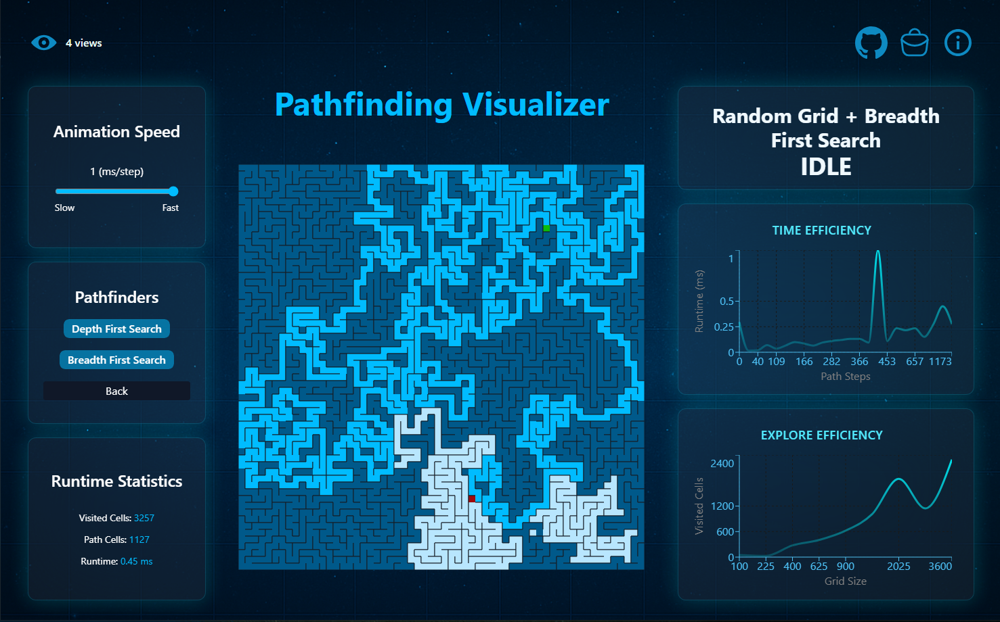

# 🔍 Pathfinding & Maze Visualizer

Welcome to the **Pathfinding Visualizer** — a sleek, futuristic web app that brings pathfinding algorithms and maze generation to life. Built with **Vite**, **React**, and **Tailwind CSS**, the visualizer showcases algorithm performance and usability in a gamified dashboard experience.

---

## ⚙️ Tech Stack

| Category | Tools & Services |
|----------|------------------|
| **Core** | Vite · React · TailwindCSS |
| **UI / Motion** | AOS (Animate On Scroll) |
| **Charts** | Recharts |
| **Backend / Data** | Supabase (PostgreSQL + Auth) · Upstash Redis (unique-view counter) |
| **Hosting / CI** | Netlify |

---

## 🚀 Live Demo

👉 [Launch Visualizer](https://your-netlify-url.netlify.app)

---

## 🧠 Features

### ✅ Core Functionality
- 🔁 Toggle between **Grid Configuration** and **Pathfinding Mode**
- 🧱 Generate mazes with multiple algorithms
- 🚀 Visualize **DFS**, **BFS**, and soon more
- 🚀 Adjustable animation speed
- 📈 Real-time graphs for **Time Efficiency** and **Exploration Efficiency**
- 💡 Glassy UI with animated gradients and smooth transitions

### ✨ Interactive Extras
- 🟢 **Draggable start** and 🔴 **end nodes**:  
  Move either **after** a search finishes and the visualizer will instantly recalculate the route (no slow animation) while live-updating the canvas for quick what-if exploration.
- 📊 Hover over graph points for tooltip details.
- 👁️‍🗨️ Navbar view counter shows unique visits, powered by Upstash Redis.
